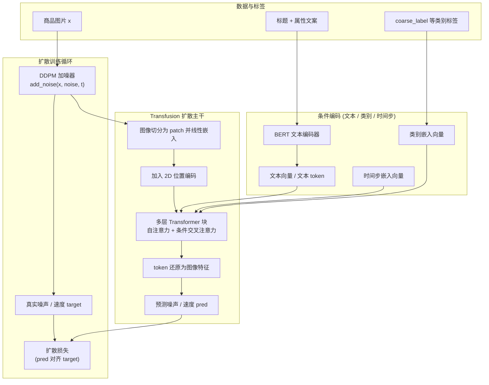

# `/mnt/d/forCoding_code/Tianchi_MUGE/ECommerce-T2I/plan_3/4_噬嗑-基于3_加入fid模块.py` 参考这份代码里做的事情，请问能否使用transfusion架构来做？如果能的话，请设计一套方案，并且给出调通的mermaid图。

可以，用 Transfusion 这类**Transformer 做扩散骨干**的架构来干你现在 4_噬嗑 脚本在做的事情，而且整体管线可以和现有工程高度兼容：  
**数据加载、BERT 文本编码、DDPM/ DDIM 调度器、FID 评估，都可以基本复用，只是把 UNet/U-ViT 主干换成一个“全 Transformer 的扩散网络”。**

下面分三部分说：

---

**一、先把“Transfusion 架构”翻译成人话**

在你这份代码里：

- 现在的主干是：**ClassConditionedUViT**
  - 先用卷积下采样到 1/8 尺度；
  - 中间一段用 ViTBlock 处理成 token；
  - 再用卷积上采样回去；
  - 条件有：类标签 + 时间步 + 文本 embedding（BERT）。

**Transfusion 思路可以理解为：**

> 既然我们已经在中间用了 ViT token，那不如把整个“学习去噪”的过程都交给 Transformer 来做，把图像当成一堆 patch token，让文本、类别、时间步都通过注意力机制与这些 token 交互。

简化理解：

- 从“卷积式 UNet 修图师” → 升级为 “Transformer 式修图师”；
- 优点：  
  - 更善于捕捉**全局布局**（对电商图的构图、文案区/商品区分布很有帮助）；  
  - 方便后面加各种**复杂条件**（文字、类标签、布局 token 等），用统一的注意力机制融合。

---

**二、结合你当前脚本，设计一套 Transfusion 方案**

下面的设计是“可落到你当前项目里的版本”，尽量保持和 `4_噬嗑-基于3_加入fid模块.py` 相同的工程骨架，只改“主干模型”。

1. **数据与条件：完全沿用当前版本**

- 数据集：继续用 `TSVCSVImageDataset`（TSV 里是 base64 图片，CSV 是 coarse_label + 文本）。
- 文本编码：继续用你现在的 BERT：
  - `tokenizer = BertTokenizer.from_pretrained(bert_path)`
  - `text_encoder = BertModel.from_pretrained(bert_path)`
  - 可以像现在一样只训练最后一层 encoder + pooler。
- 类标签：继续用 `dataset.class_to_idx` 得到 `label_id`，再做 `nn.Embedding`。

2. **Transfusion 主干（替代 ClassConditionedUViT）**

关键变化：**不再用“卷积 + 一小段 ViTBlock + 卷积解码”，而是全程在 token 维度处理图像。**

大致结构：

- **输入侧：图像 → patch token**
  - 输入图：`x`，形状 `[B, 1, H, W]`，仍然是灰度 256×256。
  - 先加噪：`noisy_x = noise_scheduler.add_noise(x, noise, timesteps)`（保持不变）。
  - 切成 patch：例如 16×16 patch，得到 `(H/16)*(W/16)` 个 patch：
    - 256×256 → 16×16 → 16×16 = 256 个 patch。
  - 每个 patch 通过一个线性层或小卷积映射成 `d_model` 维向量，得到：
    - `img_tokens`，形状 `[B, N_patches, d_model]`。

- **条件侧：文本 + 类别 + 时间步 → 条件 token / 条件向量**
  - 文本：用 BERT 得到 `text_emb`（可以用 `[CLS]` 或平均池化），再线性投到 `d_model`，用作：
    - 单个“文本 token”，或者
    - 文本序列的 token（如果用完整 BERT 序列）。
  - 类别：`class_emb = nn.Embedding(num_classes, d_model)` 得到 `class_token`。
  - 时间步：`t_emb = nn.Embedding(num_timesteps, d_model)` 得到 `time_token` 或直接加到 `img_tokens` 上。

- **Transformer 编码器：图像 token 主流，自注意 + 条件交叉注意**
  - 典型一层结构：
    1. 自注意力：在 `img_tokens` 内部做 self-attention，捕捉图像全局关系。
    2. 条件交叉注意：
       - 把 `[text_token, class_token, time_token]` 作为 key/value，
       - `img_tokens` 作为 query，做 cross-attention，让图像在去噪时“看”文本和标签。
    3. MLP 前馈层。
  - 堆叠若干层（如 12 层）。

- **输出侧：token → 图像**
  - 把处理后的 `img_tokens` reshape 回 16×16 patch 格子，再通过一个反 patchify（线性 + rearrange）得到 `[B, 1, H, W]` 的输出：
    - 输出预测的是：
      - 噪声 `eps_pred`，或
      - 速度 `v_pred`（和你现在 `prediction_type='v_prediction'` 保持一致）。

- **整体接口保持不变**（便于复用训练代码）：

你现在调用的是：

```python
pred = net(noisy_x, timesteps, y, text_emb)
```

可以让 Transfusion 模型也实现相同签名：

```python
class TransfusionDiffusionModel(nn.Module):
    def forward(self, x, t, class_labels, text_emb):
        # x: noisy_x
        # t: timesteps
        # class_labels: y
        # text_emb: BERT 输出
        ...
        return pred  # 形状 [B, 1, H, W]
```

这样你下面这些代码都可以**无感替换**：

```python
noise = torch.randn_like(x)
timesteps = torch.randint(0, 999, (x.shape[0],)).long().to(device)
noisy_x = noise_scheduler.add_noise(x, noise, timesteps)
pred = net(noisy_x, timesteps, y, text_emb)
velocity = noise_scheduler.get_velocity(x, noise, timesteps)
...
loss = (weight * (pred - velocity) ** 2).mean()
```

3. **训练循环与评估：几乎不用改**

- 训练循环（for epoch / for batch）：
  - 保留 `DDPMScheduler` + 速度预测 loss；
  - 保留 EMA 模型 `net_ema`；
  - 优化器仍然 joint 优化：
    - `params_to_optimize = list(net.parameters()) + BERT 可训练参数`。
- 采样与可视化：
  - 原来用 `net_ema` + `DDIMScheduler` 生成灰度图；
  - 现在只要替换为 `TransfusionDiffusionModel` 的 EMA 即可；
  - 采样代码逻辑仍然是：
    - 从高斯噪声开始，迭代 DDIM timesteps，反复调用 `net_ema`。
- FID 评估：
  - 依赖的是“生成图张量”和“真实图张量”，与主干结构无关；  
  - 你刚刚迁移的 FID 代码可以继续直接用。

---

**三、训练流程的 Mermaid 图（Transfusion 版，语法已调通）**

这张图对应“单个 batch 的训练前向”：



阅读方式：

- **DataPrep**：来自 TSV+CSV 的图片、文本、coarse_label。
- **CondEnc**：
  - 文本通过 BERT 变成 `TextTok`；
  - 类标签通过 Embedding 变成 `ClassEmb`；
  - 时间步 `t` 通过 Embedding 变成 `TimeEmb`。
- **TransFusionModel**：
  - `IMG` 经 `Noise` 得到带噪图 `x_t`，再进入 `Patchify` → `PosEnc` → `TFBlocks`；
  - 在 `TFBlocks` 里，图像 patch token 用自注意力感知全局，又通过交叉注意力“看”文本和类标签；
  - 最后 `Unpatchify` 还原为图像特征，`Pred` 输出对噪声/速度的预测。
- **TrainLoop**：
  - `Noise` 同时也生成训练目标 `Target`（真实噪声或速度）；
  - 用 `Loss` 把 `Pred` 与 `Target` 对齐，做反向传播。

---

**四、适合你当前项目的几点建议**

- **渐进方案**：  
  你现在已经有一个“UViT + MoE 的混合结构”，其实已经部分在走 Transfusion 思路了。  
  推荐做法：
  1. 先实现一个小型 Transfusion（patch 较大、层数较少）验证 pipeline 能跑通；
  2. FID/FID 曲线稳定后，再逐步加大模型容量。
- **工程复用**：
  - 把现在的 `ClassConditionedUViT` 换成 `TransfusionDiffusionModel`，保持相同的 `forward(x, t, y, text_emb)` 接口，可以最大程度复用训练和评估代码；
  - BERT、数据集、DDPM/ DDIM、FID、HTML 可视化都不需要大改。

如果你愿意，下一步我可以帮你把一个**最小可行的 TransfusionDiffusionModel 类的结构草图**（仅包含模块拼装，不含复杂细节）写出来，方便你直接在当前脚本中新建一个模型类对比实验。