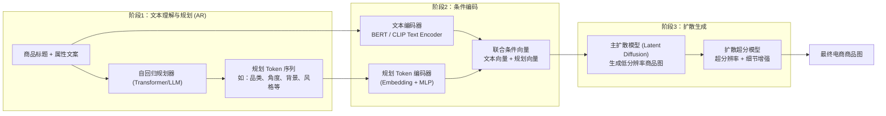
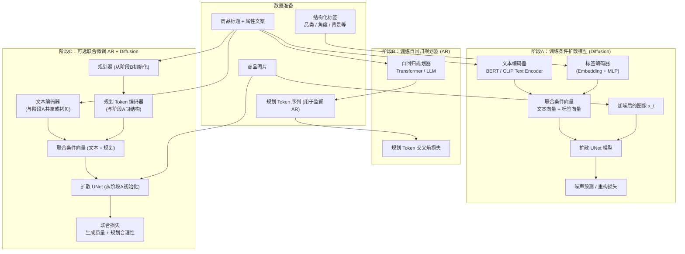

# 所谓的AR+Diffusion很火，帮忙解读一下，如果要用AR+Diffusion来做本次的项目，整体框架是怎么样的？请用文字和mermaid来解释，mermaid代码你自己要调试通，要讲让产品经理和初级多模态算法工程师都能懂得话。

可以，把“AR + Diffusion”理解成：  
**用一个擅长“规划/讲故事”的大脑（AR）+ 一个擅长“画细节”的画师（Diffusion）**，一起干活。

下面先用项目视角说整体框架，再用 Mermaid 图展示。

---

**一、AR + Diffusion 是什么组合？**

- **AR（自回归模型）**  
  - 典型形态：Transformer / LLM。  
  - 特长：一步步生成离散符号/Token，非常适合做**“文本理解、内容规划、结构生成”**。  
  - 类比：文案策划 + 分镜师，负责“想清楚要画什么、怎么构图”。

- **Diffusion（扩散模型）**  
  - 典型形态：UNet + DDPM / Latent Diffusion。  
  - 特长：从噪声中逐步“去噪”，非常擅长**纹理、光影、细节、逼真度**。  
  - 类比：画师，拿着策划好的分镜，专心画高质量图像。

**AR + Diffusion 的核心想法**：  
让 AR 负责“**脑子里的计划**”，让 Diffusion 负责“**手上的画功**”。

---

**二、放到你这次电商文生图项目里：整体框架**

我们假设你的任务是：  
输入电商商品标题 + 属性文案 → 生成符合风格的电商主图（或详情图）。

可以设计一个两阶段框架：

### 1. 阶段一：AR 负责“理解 + 规划”（Text → Planning Tokens）

输入：
- 商品标题（如：“夏季新款女装 雪纺连衣裙”）
- 属性（颜色=粉色，场景=沙滩，拍摄角度=半身，模特=有/无 等）

AR 模块（自回归 Transformer）做的事情：

1. **理解文案语义**  
   - 把标题 + 属性编码成向量，理解“这是什么品类、什么风格、什么场景”。

2. **生成“规划 Token”（离散条件）**，比如：
   - 品类：dress
   - 拍摄类型：full-body / half-body
   - 视角：正面 / 侧面
   - 背景模板：纯色 / 场景（海边、室内）
   - 气氛/风格：简约 / 小清新 / 高级感

这些规划 Token 是**离散的、可解释的条件**，类似于“画图提示词的结构化版本”。

产出：
- 一串规划 Token（Planning Tokens）：`[CATEGORY=dress, ANGLE=front, BG=beach, STYLE=fresh, ...]`

### 2. 阶段二：Diffusion 负责“根据规划画图”（Planning + Text → Image）

输入给扩散模型的条件：
- 文本编码：商品标题 + 属性 → 文本 Encoder（可以是 BERT/CLIP Text Encoder）
- 规划 Token 编码：把 AR 的规划结果映射成向量（Embedding）

Diffusion 模块做两件事：

1. **低分辨率生成（主扩散模型）**
   - 使用 Latent Diffusion：在隐空间里，从纯噪声一步步去噪，生成一个**低分辨率但结构正确**的商品图（比如 256×256）。
   - 去噪过程中，每一步都在“看”文本编码 + 规划 Token，保证：
     - 商品种类正确（不会把裙子画成裤子）
     - 角度、构图合理（半身/全身、居中/偏左）
     - 背景风格符合规划（沙滩 / 纯色 / 家居）

2. **超分辨 / 精细化（上采样扩散模型）**
   - 再接一个小的 Diffusion 超分模型，把 256×256 放大到 512×512 或更高，并细化纹理（布料纹理、阴影、边缘）。

输出：
- 最终电商商品图，可以直接用作主图或底稿。

---

**三、训练层面的简要说明（给初级多模态工程师）**

可以分两条线（可并行设计）：

1. **先训练 Diffusion 主体**
   - 条件：真实商品图 + 文本（标题/属性） + 一些“简单标签”（品类、角度等）。
   - 目标：学会“在有这些条件时，生成逼真商品图”。

2. **再训练 AR 规划器**
   - 数据：文本（标题/属性） → 已有的结构化标签（或从图中自动/规则抽取）。
   - 目标：学会从文本推断出合适的“规划 Token”。

之后可以考虑：
- 在统一的 pipeline 里做**联合微调**（让 AR 的规划更贴合 Diffusion 的偏好）。
- 规划 Token 可以逐步升级：从“品类/角度”到更细粒度的“布局格子、目标位置”等。

---

**四、整体框架 Mermaid 图（已按你之前问题调过写法）**

---

**五、给 PM 的一句话总结**

- 单用 Diffusion：会画，但在“画什么、怎么构图”上可能不够聪明，需要很多人工调 Prompt。
- 加上 AR：
  - 更擅长理解复杂商品文案（长标题 + 属性）。
  - 能自动做“拍摄脚本”和“美术分镜”（规划 Token）。
  - 让 Diffusion 更稳定、更可控地生成**业务需要的商品图**，而不是只会“画得好看但不符合运营需求”的图。

如果你愿意，下一步我可以帮你：  
- 具体化你当前电商数据集下**规划 Token 的设计方案**（字段怎么选、怎么标），  
- 或者画一张**训练流程的 Mermaid 图**（包括数据流、损失函数、联合训练方式）。

# 请你结合上一个问题，进一步把训练流程也画成mermaid图吧。mermaid代码务必要调通。

下面是把 **AR + Diffusion 训练流程** 也画成 Mermaid 的版本，并且我按照你之前遇到的问题，把语法都处理成在常见环境中能正常渲染的写法（子图标题和包含空格/中文的文本全部加了引号，没有用 `linkStyle`）。

先用文字讲一遍，再给 Mermaid 图。

---

**一、训练流程整体拆解**

围绕「用 AR + Diffusion 做电商文生图」，训练可以分为三条主线：

1. **阶段 A：训练条件 Diffusion（画得像）**
   - 输入：商品图片 + 文本（标题/属性） + 结构化标签（品类、角度、背景等）。
   - 模型：
     - 文本编码器（Text Encoder）：把标题/属性变成向量。
     - 标签编码器（Plan/Label Encoder）：把结构化标签变成向量。
     - 扩散模型（UNet）：在噪声空间里学会一步步还原商品图。
   - 损失：噪声预测 / 重构损失（标准 DDPM/LDM 的 loss）。

2. **阶段 B：训练 AR 规划器（想得对）**
   - 输入：商品文本（标题 + 属性）。
   - 目标：预测**规划 Token 序列**（类似“品类=连衣裙、角度=半身、背景=海边、风格=小清新”等）。
   - 模型：自回归 Transformer（类似一个小 LLM）。
   - 损失：规划 Token 的交叉熵（预测 Token vs 标注 Token）。

3. **阶段 C：可选联合微调（想得对 + 画得好）**
   - 把阶段 A 训练好的 Diffusion 和阶段 B 的 AR 规划器连起来，用真实图片做弱监督：
     - AR 先从文本预测规划 Token。
     - 这些 Token + 文本一起喂给 Diffusion 生成图像。
     - 再用生成图 vs 真实图的差异，给 AR + Diffusion 做联合调整（或者只调 AR，让它学会生成更“合 Diffusion 口味”的规划）。

---

**二、训练流程 Mermaid 图（已按你环境调好语法）**

---

**三、如何向 PM 和初级多模态工程师解释这张图**

- **数据准备（DataPrep）**  
  - 我们收集已有的商品图 + 标题/属性，并（人工或规则）标注出结构化标签，比如：
    - 品类：连衣裙、运动鞋、耳机…
    - 拍摄角度：半身、全身、45° 侧面…
    - 背景：纯色、客厅、海边…
  - 同时，这些标签可以直接当作 **规划 Token 的“真值”**（用于监督 AR）。

- **阶段 A（TrainDiffusion）——“先教画家照着标签画”**  
  - 目标：教会 Diffusion 在知道「文本 + 标签」的情况下，把噪声还原成真实商品图。
  - 核心：传统条件 Diffusion 训练，只是多加了结构化标签这一路条件。

- **阶段 B（TrainAR）——“再教文案如何写出好规划”**  
  - 目标：从文本直接预测出“拍摄规划”（规划 Token）。
  - 这一步让系统能在**只知道商品文案**时，也能自动想出“用什么构图、背景、风格”。

- **阶段 C（JointTrain，可选）——“规划 + 画图一起对齐业务目标”**  
  - 把 AR 预测出来的规划 + 文本一起喂给 Diffusion 生成图，再和真实商品图对比。
  - 如果生成效果不好，反向调整：
    - 调 AR：让它学会给出更符合 Diffusion 优势的规划。
    - 调 Diffusion：让它更顺从 AR 给出的规划去画。

---

如果你愿意，下一步我可以帮你：

- 把 **阶段 A 的损失函数** 写成更工程化的公式（带噪声调度、$t$ 的采样等），  
- 或者针对你当前 `ECommerce-T2I` 项目，示意一下可以从现有标注中直接抽哪些字段做「规划 Token」。