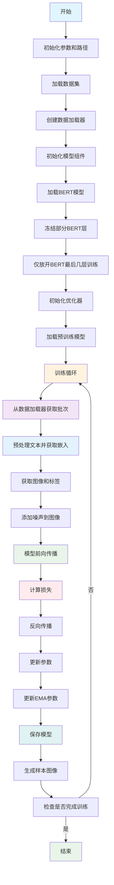
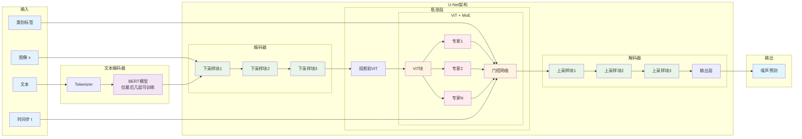
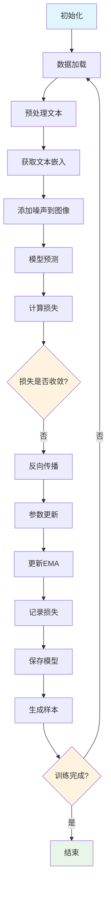

小波变换（Wavelet Transform）是一种数学变换方法，用于分析和处理时变信号或图像。它是傅里叶变换的一种扩展，但具有更好的时间-频率局部化特性。

### 基本概念
1. **小波（Wavelet）**：具有有限持续时间和快速衰减特性的波形，其平均值为零。常见的小波函数包括 Haar、Daubechies、Morlet、Mexican Hat 等。

2. **母小波（Mother Wavelet）**：作为基础的小波函数，通过缩放和平移生成其他小波。

3. **子小波（Daughter Wavelet）**：通过对母小波进行缩放（改变频率）和平移（改变时间/空间位置）得到的一系列小波。

### 主要特点
与傅里叶变换相比，小波变换具有以下优势：
- **时间-频率局部化**：能够同时提供信号在时间和频率域的局部信息，适合分析非平稳信号。
- **多分辨率分析**：可以在不同尺度上分析信号，实现从粗略到精细的渐进分析。
- **自适应窗口**：高频部分使用窄时间窗口，低频部分使用宽时间窗口，有效平衡时间和频率分辨率。

### 主要类型
1. **连续小波变换（CWT）**：使用连续变化的尺度和平移参数，提供高度详细的时间-频率表示。
2. **离散小波变换（DWT）**：使用离散化的尺度和平移参数，计算效率更高，适合实际应用。
3. **小波包变换（WPT）**：对信号的所有频段进行分解，比 DWT 提供更灵活的频率划分。

### 应用领域
小波变换在许多领域都有广泛应用：
- **信号处理**：去噪、压缩、特征提取、模式识别
- **图像处理**：图像压缩（JPEG2000标准）、边缘检测、图像增强
- **语音处理**：语音识别、语音压缩、语音分析
- **医学成像**：MRI、CT图像分析与处理
- **地球物理学**：地震信号分析、石油勘探
- **金融分析**：股价趋势分析、风险评估

小波变换的核心思想是用一组具有良好局部化特性的基函数（小波）来表示信号，从而更好地捕捉信号中的瞬态特征和局部变化。
        
          
我将解析这份代码，分析其关键类、步骤和流程，并制作相应的图表说明。

首先，让我读取这份代码文件的内容。

        
            
toolName: view_files
            
status: success
          
            
filePath: /mnt/d/forCoding_code/Tianchi_MUGE/ECommerce-T2I/plan_3/3_观-基于1_放开部分bert的层来训练.py
          
让我读取文件的剩余部分，以获得完整的代码。

        
            
toolName: view_files
            
status: success
          
            
filePath: /mnt/d/forCoding_code/Tianchi_MUGE/ECommerce-T2I/plan_3/3_观-基于1_放开部分bert的层来训练.py
          
现在我已经完整地读取了代码文件。下面我将分析代码的关键类、步骤和流程，并制作相应的图表说明。

## 代码解析

### 关键类

1. **TSVCSVImageDataset** - 数据集类
   - 从TSV和CSV文件加载图片、标签和文本数据
   - 支持图像预处理和文本提取

2. **ViTBlock** - 视觉Transformer块
   - 实现多头注意力机制
   - 包含层归一化和MLP块

3. **ClassConditionedUViT** - 主要模型类
   - 基于U-Net和ViT的扩散模型
   - 集成文本编码器（BERT）
   - 使用专家混合（MoE）架构

4. **BertModel** - 文本编码器
   - 预训练的BERT模型
   - 部分层被设置为可训练

### 主要步骤和流程

1. **数据加载** - 从TSV和CSV文件加载图片和文本
2. **模型初始化** - 初始化U-Net、BERT和调度器
3. **BERT微调** - 仅训练BERT的最后几层
4. **训练循环** - 扩散模型训练过程
5. **模型保存** - 保存训练的模型参数
6. **图像生成** - 使用训练模型生成新图像

### 代码流程图

### 模型架构图

### 训练流程图

### 关键技术特点

1. **部分BERT微调**：只放开BERT的最后几层进行训练，其余层保持冻结状态
2. **文本条件生成**：使用BERT编码的文本嵌入作为条件输入
3. **专家混合架构**：使用多个专家网络处理不同风格的内容
4. **门控机制**：根据类别、时间和全局特征动态选择专家权重
5. **扩散模型**：使用DDPM/DDIM调度器进行图像生成

这份代码实现了一个基于文本条件的扩散模型，通过放开BERT模型的部分层进行微调，以实现更好的文本-图像生成效果。